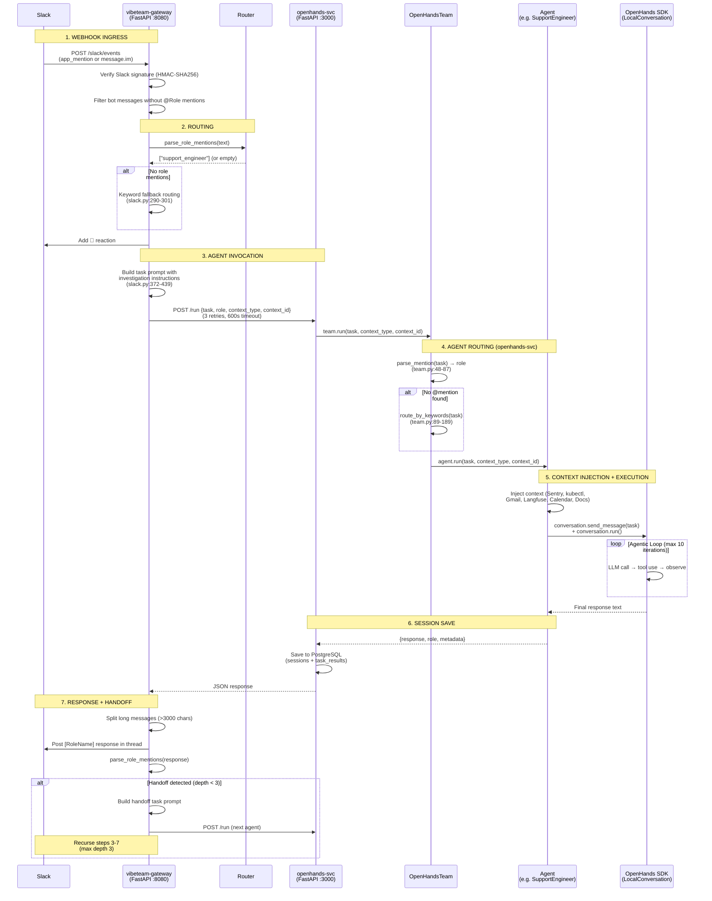

# Current Work Plan: Slack Webhook Fix

## Goal
Fix Slack webhook routing so messages to @VibeTeam/@ReleaseEngineer are received by the gateway and routed to agents.

## Status: Blocked on Manual Action

## Background

User reported that Slack messages to `@ReleaseEngineer` weren't getting responses.

**Root Cause:** Slack app webhook URL was misconfigured:
- Wrong: `https://team.vibebrowser.app/slack/events` (routes to OpenHands, doesn't handle Slack)
- Correct: `https://webhook.team.vibebrowser.app/slack/events` (routes to vibeteam-gateway)

## Checklist

- [x] Diagnose why Slack messages aren't being received
- [x] Identify correct webhook endpoint (`webhook.team.vibebrowser.app`)
- [x] Verify gateway responds to Slack challenge verification
- [x] Update `templates/slack-app/manifest.yaml` with correct URLs
- [x] Verify Kubernetes cluster is healthy (all pods running)
- [x] Commit manifest.yaml fix to git (1b71032)
- [x] Create PR for Slack fix: https://github.com/VibeTechnologies/VibeTeam/pull/54
- [ ] **MANUAL:** Update Slack app Event Subscriptions URL
- [ ] **MANUAL:** Update Slack app Interactivity URL  
- [ ] Verify Slack events arrive at gateway (check logs)
- [ ] Test end-to-end: mention @VibeTeam and confirm response

## Manual Steps Required

### Update Slack App Configuration

1. Go to: https://api.slack.com/apps/A0AAZGWEAVA/event-subscriptions

2. Change **Request URL** to:
   ```
   https://webhook.team.vibebrowser.app/slack/events
   ```

3. Click **Save Changes** - Slack will verify the endpoint

4. Go to: https://api.slack.com/apps/A0AAZGWEAVA/interactivity

5. Change **Request URL** to:
   ```
   https://webhook.team.vibebrowser.app/slack/interactive
   ```

6. Click **Save Changes**

### Verify the Fix

```bash
# Watch gateway logs for incoming Slack events
kubectl logs -f deployment/vibeteam-gateway -n vibeteam | grep -i slack

# In another terminal, send a test message in Slack mentioning @VibeTeam
```

## Ingress Routing Reference

| Hostname | Service | Port | Purpose |
|----------|---------|------|---------|
| `team.vibebrowser.app` | openhands-svc | 3000 | OpenHands web UI |
| `webhook.team.vibebrowser.app` | vibeteam-gateway | 8080 | Slack/Discord webhooks |

---

## Completed: PR #25 Cherry-Pick (Documentation Knowledge Base)

**Original PR:** https://github.com/VibeTechnologies/VibeTeam/pull/25 (has major conflicts)
**New PR:** https://github.com/VibeTechnologies/VibeTeam/pull/55

### What was done
- [x] Cherry-picked `vibeteam/connectors/docs.py` from PR #25
- [x] Cherry-picked `vibeteam/tools/docs.py` from PR #25
- [x] Fixed lint errors (unused imports, f-string)
- [x] Updated `__init__.py` files to export new classes
- [x] Verified imports work correctly
- [x] Created PR #55 as replacement for PR #25

### Next steps for PR #25
- PR #25 can be closed after PR #55 is merged
- The CLI command (`vibeteam docs sync`) from PR #25 was not cherry-picked (lower priority)

---

## Open PRs

| PR | Title | Status |
|----|-------|--------|
| #54 | fix(slack): correct webhook URLs | Ready for review |
| #55 | feat: add Documentation Knowledge Base tool | Ready for review |
| #25 | feat: Documentation Knowledge Base (original) | Can close after #55 merges |

---

## Completed: OpenHands Agent Evaluation Fix (2026-02-10)

All agent evaluation scenarios now pass. The final verification was completed on 2026-02-10.

### All Scenarios Pass ✅

| Scenario | Status | Key Metrics |
|----------|--------|-------------|
| `support_400_errors` | ✅ PASSED | InvestigationQuality: 0.90, EvidenceBasedDecision: 1.00 |
| `support_notify_check` | ✅ PASSED | NotificationOnly: 1.00 |
| `github_issue` | ✅ PASSED | IssueAnalysis: 0.70, TaskCompletion: 0.80 |
| `release_deploy` | ✅ PASSED | DeploymentExecution: 0.90, TaskCompletion: 1.00 |
| `stripe_webhook_failure` | ✅ PASSED | InvestigationQuality: 0.90, TaskCompletion: 0.90 |

### Key Fixes Applied

1. **Dev overlay with git-sync**: Applied `k8s/overlays/dev` to enable hot reload of agent code
2. **Strict iteration limit**: Max 10 tool calls to prevent stuck loops
3. **Anti-looping instructions**: Agents stop if viewing same file twice
4. **Mandatory gh output redirection**: Prevents terminal hanging
5. **Credential warning**: Added warning to eval script if Azure endpoint looks wrong

### Running Evaluations

```bash
# Unset any shell env vars that might override .env
unset AZURE_OPENAI_ENDPOINT AZURE_OPENAI_API_KEY AZURE_API_BASE AZURE_API_KEY

# Load from .env and run all scenarios
export $(grep -v '^#' .env | grep -E '^AZURE_' | xargs)
for scenario in support_400_errors support_notify_check github_issue release_deploy stripe_webhook_failure; do
  uv run python scripts/eval_slack_e2e.py --scenario $scenario --channel C0AATPSADB8 --timeout 180
done
```

---

## Completed: OpenCode Agent Configurations (2026-02-09)

Created three specialized OpenCode primary agents in `~/.config/opencode/agents/`:

| Agent | Model | Focus |
|-------|-------|-------|
| **FrontendSoftwareEngineer** | `github-copilot/gemini-3-pro-preview` | WebUI — React, TypeScript, CSS, UI/UX |
| **StaffSoftwareEngineer** | `github-copilot/claude-opus-4.6` | System design, debugging, troubleshooting |
| **BackendSoftwareEngineer** | `github-copilot/gpt-5.2-codex` | Backend implementation of designed tasks |

### What was done
- [x] Created `~/.config/opencode/agents/` directory
- [x] Created `FrontendSoftwareEngineer.md` with Gemini 3 Pro Preview model
- [x] Created `StaffSoftwareEngineer.md` with Claude Opus 4.6 model
- [x] Created `BackendSoftwareEngineer.md` with GPT 5.2 Codex model
- [x] Registered `gemini-3-pro-preview`, `claude-opus-4.6`, `gpt-5.2-codex` in `opencode.json`
- [x] Verified all 3 model IDs resolve via `opencode models`
- [x] Added `steps: 50` cost control to all agents
- [x] Added `permission.task` rules for subagent invocation control

### Usage
- **Tab** to cycle between Build, Plan, and the three new agents
- Each agent has full tool access (write, edit, bash) with allow permissions
- Max 50 agentic steps per turn for cost control

---

## Architecture Analysis: End-to-End Message Flow (2026-02-10)

### Checklist

- [x] Trace full message flow from Slack to agent response
- [x] Document duplicate role-parsing systems with file:line refs
- [x] Create agent architecture comparison table
- [x] Create mermaid diagram of end-to-end flow
- [x] Analyze latency bottlenecks
- [x] Test /slack/trigger endpoint

### Improvement Checklist

- [ ] Validate mermaid diagram renders correctly
- [ ] Consolidate 3 role-parsing systems into single RoleResolver
- [ ] Parallelize kubectl context injection (sequential → concurrent)
- [ ] Skip non-existent deployments in kubectl context
- [ ] Pull real [TIMING] metrics from logs to validate latency estimates
- [ ] Verify /slack/trigger test actually produced agent response

### End-to-End Flow Diagram



### Three Duplicate Role-Parsing Systems

There are **three separate implementations** that map text to agent roles. They use different syntax, support different aliases, and could diverge if roles are added or renamed.

#### System 1: Gateway Router (regex-based)

**File:** `vibeteam/router/router.py:52-57` + `vibeteam/router/models.py:85-97`

```python
ROLE_PATTERN = re.compile(
    r"[@/](SoftwareEngineer|ReleaseEngineer|SupportEngineer|"
    r"ProductManager|MarketingManager|"
    r"SWE|Release|Support|PM|Marketing)",
    re.IGNORECASE,
)
```

- **Prefix:** `@` or `/`
- **Returns:** list of all matches (deduped)
- **Short forms:** SWE, Release, Support, PM, Marketing
- **Persona names:** Not supported
- **Used by:** Gateway webhook handler + handoff detection

#### System 2: OpenHands Team (string `in` matching)

**File:** `agents/openhands/team.py:48-87`

```python
release_patterns = ["@releaseengineer", "@release", "@einstein"]
marketing_patterns = ["@marketingmanager", "@marketing", "@ada"]
support_patterns = ["@supportengineer", "@support", "@grace"]
product_patterns = ["@productmanager", "@product", "@pm"]
software_patterns = ["@softwareengineer", "@swe", "@dev"]
```

- **Prefix:** `@` only (no `/`)
- **Returns:** first match only (not a list)
- **Short forms:** release, support, swe, pm, product, dev
- **Persona names:** einstein, ada, grace, maya (not listed but implied), alan (not listed)
- **Used by:** openhands-svc to select which agent class to instantiate

#### System 3: Slack Tools Display Names

**File:** `agents/shared/slack_tools.py:652-662`

```python
display_names = {
    "swe": "SoftwareEngineer",
    "release": "ReleaseEngineer",
    "support": "SupportEngineer",
    "pm": "ProductManager",
    "marketer": "MarketingManager",  # <-- "marketer" not "marketing"
    "supervisor": "ProductManager",  # <-- extra alias
}
```

- **Purpose:** Maps internal agent keys to display names for Slack message prefixes
- **Anomalies:** Uses "marketer" (not "marketing"), includes "supervisor" alias

#### Divergence Risks

| Feature | Gateway Router | OpenHands Team | Slack Tools |
|---------|---------------|----------------|-------------|
| `/` prefix | Yes | No | N/A |
| `@` prefix | Yes | Yes | N/A |
| Persona names (einstein, grace...) | No | Yes | No |
| `@dev` alias | No | Yes | No |
| `@product` alias | No | Yes | No |
| `marketer` key | No | No | Yes |
| `supervisor` key | No | No | Yes |
| Multi-match | Yes (list) | No (first) | N/A |

**Concrete risk:** If a user says `@einstein please deploy`, the gateway router will NOT recognize it (no match → keyword fallback), but the OpenHands team parser WILL map it to `release_engineer`. These two systems route independently — the gateway already picked a role before openhands-svc even sees the message. So the openhands team parser is effectively redundant for Slack-originated requests, since the gateway already resolved the role and passes it as `role=` in the `/run` payload.

**Recommendation:** Consolidate into a single `RoleResolver` class in `agents/shared/` that all three systems import. This would:
1. Eliminate divergence risk
2. Make persona name support consistent
3. Single place to add new roles/aliases

### Agent Architecture Comparison

| Agent | Persona | Execution Model | Tools | Context Injection |
|-------|---------|----------------|-------|-------------------|
| **SupportEngineer** | Grace | `send_message()` + `run()` (agentic loop, max 10 iters) | TerminalTool, FileEditorTool | Sentry, kubectl, Gmail, Calendar, Langfuse, Docs (keyword-conditional) |
| **ReleaseEngineer** | Einstein | `send_message()` + `run()` (agentic loop, max 10 iters) | TerminalTool, FileEditorTool | kubectl (always) |
| **SoftwareEngineer** | Alan | `send_message()` + `run()` (agentic loop, max 10 iters) | TerminalTool, FileEditorTool | GitHub issues (if `#NNN`), kubectl (if infra keywords) |
| **ProductManager** | Maya | `ask_agent()` (single LLM call) | None | None |
| **MarketingManager** | Ada | `ask_agent()` (single LLM call) | None (MCP config exists) | Browser context (URL fetch, web search) |

**Key difference:** `send_message()` + `run()` = full agentic loop where the LLM can iteratively use tools (run shell commands, edit files, inspect output). `ask_agent()` = single LLM call with no tool access — the agent can only produce text.

**Implication:** ProductManager and MarketingManager cannot:
- Run kubectl commands
- Execute shell commands
- Edit files
- Access GitHub CLI

They can only reason about text provided in their prompt. If they need tool access (e.g., ProductManager creating GitHub issues via `gh`), they must be refactored to use `send_message()` + `run()`.

### Latency Analysis

#### Context Injection Bottleneck

`get_kubectl_context()` (`agents/shared/kubectl_tools.py:148-241`) runs the following **sequential** subprocess calls, each with a 30-second timeout:

| # | Command | Timeout |
|---|---------|---------|
| 1 | `kubectl get pods -n vibeteam -o wide` | 30s |
| 2 | `kubectl get events -n vibeteam --sort-by=.lastTimestamp` | 30s |
| 3 | `kubectl logs deployment/vibeteam-gateway --tail=50` | 30s |
| 4 | `kubectl logs deployment/openhands-svc --tail=50` | 30s |
| 5 | `kubectl logs deployment/autogen-svc --tail=50` | 30s |
| 6 | `kubectl logs deployment/crewai-svc --tail=50` | 30s |
| 7 | `kubectl rollout history deployment/vibeteam-gateway` | 30s |

**Best case:** ~1-2s total (fast cluster, all commands succeed quickly)
**Worst case:** 7 × 30s = **210 seconds** before the agent even starts its LLM loop

The `crewai-svc` and `autogen-svc` deployments may not even exist, causing `kubectl logs` to wait until timeout. This is the most likely cause of slow responses.

**Recommendations:**
1. Run kubectl commands concurrently with `asyncio.gather()` or `concurrent.futures.ThreadPoolExecutor`
2. Reduce timeout from 30s to 10s for non-critical commands (logs, rollout history)
3. Only fetch logs for deployments that actually exist (check `get_pods` output first)
4. Cache kubectl results for 30-60s to avoid redundant fetches during handoff chains

#### Handoff Chain Latency

With max handoff depth 3, a single Slack message can trigger up to 4 sequential agent invocations:

```
Message → Agent A (context inject + LLM loop) → response
  → Handoff detected → Agent B (context inject + LLM loop) → response
    → Handoff detected → Agent C (context inject + LLM loop) → response
      → Handoff detected → Agent D (context inject + LLM loop) → response
```

Each agent invocation includes:
- Context injection: 1-210s (kubectl) + 5-30s (Sentry, Gmail, Langfuse)
- LLM agentic loop: 10-120s per iteration, up to 10 iterations
- HTTP overhead: 3 retries with exponential backoff on failure

**Realistic worst case for a full handoff chain:** 4 × (30s context + 60s LLM) = **~6 minutes**

The gateway has a 600s (10 min) HTTP timeout per agent call (`server.py:208`), so individual calls won't time out, but the user experience degrades significantly with deep handoff chains.

#### Also: Duplicate Keyword Routing

Both the gateway (`slack.py:290-301`) and openhands-svc (`team.py:89-189`) have keyword-based routing. The gateway's version is simpler (5 categories) while the openhands-svc version is more comprehensive (10 keyword lists). Since the gateway resolves the role first and passes it explicitly via `role=` in the `/run` payload, the openhands-svc keyword router is only used when `role` is not provided (non-Slack invocations).

---

## Open PRs (updated 2026-02-10)

| PR | Title | Status |
|----|-------|--------|
| #58 | fix: remove /slack/trigger bypass | Open |
| #55 | feat: add Documentation Knowledge Base tool | Open |
| #54 | fix(slack): correct webhook URLs | Open (blocked on manual Slack config) |
| #53 | [WIP] GitHub App auth + Sentry webhooks | Draft |
| #51 | feat: User Document Upload for Knowledge Base | Open |
| #50 | feat: GitHub App Auth & Sentry Integration | Open |

---

## Completed: Eval Script Consolidation (2026-02-10)

### Goal
Consolidate `scripts/eval_slack_e2e.py` and `scripts/eval_slack_agent.py` into a single unified eval script.

### Checklist

- [x] Analyze both scripts for feature parity
- [x] Add `--message` CLI flag for custom messages (from eval_slack_agent.py)
- [x] Add `--skip-eval` CLI flag (from eval_slack_agent.py)
- [x] Update `run_evaluation()` to support custom_message and skip_eval
- [x] Custom message mode creates minimal scenario with basic TaskCompletion criteria
- [x] Fix all ruff lint issues
- [x] Delete `scripts/eval_slack_agent.py`
- [x] Run stripe_webhook_failure eval to verify consolidated script works

### Eval Results (stripe_webhook_failure)

| Metric | Score | Threshold | Status |
|--------|-------|-----------|--------|
| InvestigationQuality | 0.90 | 0.60 | PASS |
| TaskCompletion | 0.90 | 0.60 | PASS |
| EvidenceBasedDecision | 0.90 | 0.60 | PASS |
| HandoffCompletion | 0.70 | 0.60 | PASS |

Agent correctly: checked Sentry, verified pods via kubectl, tested endpoint with curl (found 404), identified missing route as root cause, handed off to SoftwareEngineer.

### Architecture Note: /slack/trigger is Correct

The `/slack/trigger` endpoint is the **correct design** for eval and programmatic triggering. Slack bots cannot receive their own messages as webhook events (the Slack app subscribes to `app_mention` and `message.im`, NOT `message.channels`). PR #58 which proposed removing `/slack/trigger` should be closed.

---
Last updated: 2026-02-10
