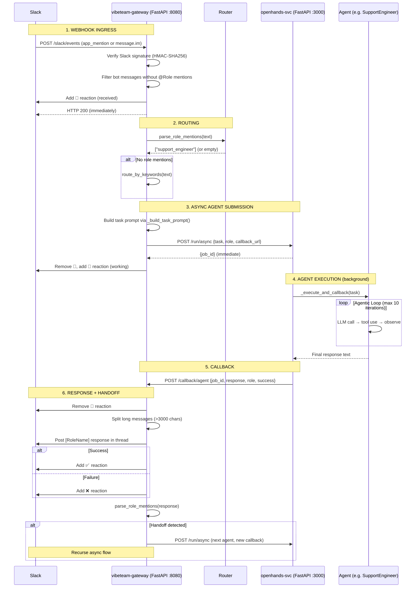

# Current Work Plan

## Status: Async callback architecture COMPLETE — ready to commit and PR

**Branch:** `feat/async-agent-callback` (from `fix/agent-timeout-improvements`)
**Working tree:** Clean
**Open PRs:** Pending — ready to create
**Deployments:** All running (gateway, openhands-svc, openhands-agents, autogen, crewai, scheduler)

---

## Open Issues

| Issue | Title | Status | Notes |
|-------|-------|--------|-------|
| #48 | Verify Langfuse Integration | Open | Needs end-to-end validation |
| #47 | User Document Upload for Knowledge Base | Open | Feature request — upload PDFs/docs via API |
| #22 | Complete VibeTeam Integration Setup | Open | Umbrella issue — most items done, some remain |

## Blocked

| Item | Blocker |
|------|---------|
| Slack webhook delivery | Needs human with Slack admin access to update URLs at https://api.slack.com/apps/A0AAZGWEAVA/event-subscriptions to `https://webhook.team.vibebrowser.app/slack/events` |

---

## Architecture Reference

### End-to-End Flow Diagram (Async Callback — NEW)

### Agent Architecture

| Agent | Persona | Execution Model | Tools | Context Injection |
|-------|---------|----------------|-------|-------------------|
| **SupportEngineer** | Grace | `send_message()` + `run()` (agentic loop, max 10 iters) | TerminalTool, FileEditorTool | Sentry, kubectl, Gmail, Calendar, Langfuse, Docs (keyword-conditional) |
| **ReleaseEngineer** | Einstein | `send_message()` + `run()` (agentic loop, max 10 iters) | TerminalTool, FileEditorTool | kubectl (always) |
| **SoftwareEngineer** | Alan | `send_message()` + `run()` (agentic loop, max 10 iters) | TerminalTool, FileEditorTool | GitHub issues (if `#NNN`), kubectl (if infra keywords) |
| **ProductManager** | Maya | `ask_agent()` (single LLM call) | None | None |
| **MarketingManager** | Ada | `ask_agent()` (single LLM call) | None (MCP config exists) | Browser context (URL fetch, web search) |

### System Prompt Template

All 5 agents use `agents/openhands/prompts/agent_system.j2` which renders `{{ agent_context }}` (persona + instructions) into the OpenHands system prompt. This was fixed in PR #63 — previously `agent_context` was silently dropped because the default OpenHands template ignores unknown kwargs.

### Role Resolution & Keyword Routing

Consolidated into `agents/shared/role_resolver.py`:
- **Role mention parsing** (PR #59) — Supports full names, short forms (swe/pm), persona names (einstein/grace/ada), and extras (dev/product/marketer/supervisor). 37 unit tests.
- **Keyword routing** (`652cfc6`) — Single `route_by_keywords()` function used by both gateway and openhands-svc. Word-boundary regex prevents false positives. ~50 parametrized tests covering all 5 roles.

### kubectl Context (Parallelized)

`agents/shared/kubectl_tools.py` uses two-phase approach (PR #59):
1. Fetch pods first (~1s) to discover existing deployments
2. Fetch events, logs, rollout history in parallel via `ThreadPoolExecutor`
3. Non-existent deployments auto-skipped

Reduced from worst-case 210s (sequential) to ~11s (parallel).

---

## In-Progress Work

### Branch: `feat/async-agent-callback` — IMPLEMENTATION COMPLETE

**Problem:** Gateway held HTTP connection open for up to 15 minutes waiting for agent response.
SWE agentic loops (clone, grep, fix, commit, PR) regularly timed out.

**Solution:** Fire-and-forget with callback:
1. 👀 eyes reaction — Gateway received the message
2. 🔄 spinner reaction — Agent picked up the task
3. Agent finishes → HTTP callback to gateway → posts result to Slack thread
4. ✅/❌ reaction — success/failure

**Changes:**
- [x] `vibeteam/gateway/server.py`: Added `call_agent_service_async()` and `GATEWAY_URL` config
- [x] `agents/openhands/server.py`: Added `POST /run/async` endpoint, `_execute_and_callback()` background task
- [x] `vibeteam/gateway/routes/slack.py`: Full refactor (1115 lines)
  - [x] Extracted `classify_task_template()` as reusable function
  - [x] Extracted `_build_task_prompt()` with deployment/notification/investigation templates
  - [x] Added `_submit_agent_async()` with emoji lifecycle management
  - [x] Added `handle_agent_callback()` — `POST /callback/agent` endpoint with CALLBACK_SECRET auth
  - [x] Refactored `run_agent_for_slack()` to support async/sync routing via `use_async` param
  - [x] All 3 event handlers pass `message_ts` for emoji targeting
  - [x] Removed dead `UnifiedMessage` construction and unused imports
- [x] `vibeteam/gateway/server.py`: Added `CALLBACK_SECRET` config for callback authentication
- [x] `agents/openhands/release_engineer.py`: Hardened prompt
  - [x] Forbid ALL `kubectl apply -k` paths (not just specific overlays)
  - [x] Added "NO LOCAL REPOSITORY FILES" warning
  - [x] Clarified image tag workflow (default to "latest")
- [x] `tests/test_async_callback.py`: 33 new tests (31 pass, 2 skip for sqlalchemy)
  - TestBuildTaskPrompt (7 tests)
  - TestRemoveReaction (3 tests)
  - TestCallbackEndpoint (11 tests — incl. 3 callback auth tests)
  - TestSubmitAgentAsync (3 tests — incl. callback_secret inclusion)
  - TestSlackEventsPassMessageTs (3 tests)
  - TestSlackTriggerSyncPath (1 test)
  - TestRunAgentForSlackRouting (3 tests)
  - TestOpenHandsRunAsync (2 tests — skip without sqlalchemy)
- [x] `tests/test_task_routing.py`: Updated to import `classify_task_template` from slack module
- [x] `tests/test_system_prompt.py`: Updated guardrail tests for broader `kubectl apply -k` ban
- [x] All 388 tests pass, 79 skipped (integration/sqlalchemy), 0 failures
- [x] Ruff lint clean on all files
- [ ] Create PR
- [ ] Deploy and run evals to verify end-to-end
- [ ] Run regression evals (support_400_errors, stripe_webhook_failure)

**Commits on branch (3 ahead of parent):**
1. `a3737d8` fix(agents): prevent ReleaseEngineer from destroying its own infrastructure (#67)
2. `e8cd10b` feat: add async agent execution with callback architecture
3. `44f0d87` feat: complete async agent callback architecture with full test coverage

---

## Completed Work

| PR/Commit | Title | Key Changes |
|-----------|-------|-------------|
| #67 | fix(agents): prevent ReleaseEngineer self-destruction | Safety guardrails, `kubectl set image` instead of `kubectl apply -k` |
| #66 | test: comprehensive Langfuse integration tests | Closes #48 |
| #64 | fix(agents): increase SWE time limit, no retry on ReadTimeout | 900s timeout, single-attempt on ReadTimeout |
| #63 | fix(agents): wire custom system prompt template | `agent_system.j2` template, all 5 agents wired |
| #62 | test: cover remaining webhook code paths | 17 new tests |
| #61 | test: comprehensive webhook coverage improvements | 8 new tests |
| #60 | fix(eval): rescore mode, handoff timeout, agent verification | `--thread-ts` rescore, SWE anti-hallucination |
| #53 | feat: GitHub App auth + Sentry webhook routing | GitHubConnector App auth, 33 integration tests |
| `652cfc6` | refactor: consolidate keyword routing into role_resolver | Single `route_by_keywords()` |
| #59 | refactor: consolidate role parsing, parallelize kubectl | RoleResolver module, ThreadPoolExecutor kubectl |
| #55 | feat: add Documentation Knowledge Base tool for agents | Docs tools |
| #54 | fix(slack): correct webhook URLs | Manifest fix (blocked on manual Slack config) |
| #57 | fix: secure /slack/trigger endpoint | SLACK_TRIGGER_SECRET, dead code cleanup |
| #56 | fix(eval): improve Azure credential handling | Credential warnings |
| #52 | fix(ci): ruff lint errors | CI lint fixes |

### Closed Issues

| Issue | Title | Reason |
|-------|-------|--------|
| #48 | Verify Langfuse Integration | Completed — PR #66 |
| #44 | Integrate DeepEval for robust agent benchmarking | Completed |
| #31 | Multi-Agent System Product Requirements | Completed — docs/requirements.md + docs/design.md |
| #24 | Documentation Knowledge Base for Agents | Completed — PR #55 |

---
Last updated: 2026-02-10
