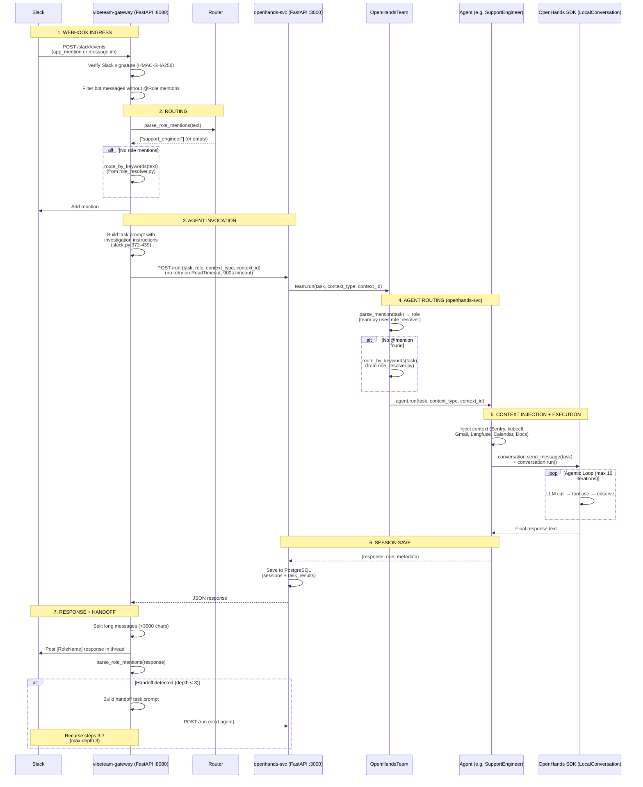

# Current Work Plan

## Status: PR in progress — fix release_deploy eval + github_issue timeout

**Branch:** `fix/release-deploy-eval` (from `master`)
**Working tree:** Modified
**Open PRs:** Pending
**Deployments:** All running (gateway, openhands-svc, openhands-agents, autogen, crewai, scheduler)

---

## Open Issues

| Issue | Title | Status | Notes |
|-------|-------|--------|-------|
| #48 | Verify Langfuse Integration | Open | Needs end-to-end validation |
| #47 | User Document Upload for Knowledge Base | Open | Feature request — upload PDFs/docs via API |
| #22 | Complete VibeTeam Integration Setup | Open | Umbrella issue — most items done, some remain |

## Blocked

| Item | Blocker |
|------|---------|
| Slack webhook delivery | Needs human with Slack admin access to update URLs at https://api.slack.com/apps/A0AAZGWEAVA/event-subscriptions to `https://webhook.team.vibebrowser.app/slack/events` |

---

## Architecture Reference

### End-to-End Flow Diagram

### Agent Architecture

| Agent | Persona | Execution Model | Tools | Context Injection |
|-------|---------|----------------|-------|-------------------|
| **SupportEngineer** | Grace | `send_message()` + `run()` (agentic loop, max 10 iters) | TerminalTool, FileEditorTool | Sentry, kubectl, Gmail, Calendar, Langfuse, Docs (keyword-conditional) |
| **ReleaseEngineer** | Einstein | `send_message()` + `run()` (agentic loop, max 10 iters) | TerminalTool, FileEditorTool | kubectl (always) |
| **SoftwareEngineer** | Alan | `send_message()` + `run()` (agentic loop, max 10 iters) | TerminalTool, FileEditorTool | GitHub issues (if `#NNN`), kubectl (if infra keywords) |
| **ProductManager** | Maya | `ask_agent()` (single LLM call) | None | None |
| **MarketingManager** | Ada | `ask_agent()` (single LLM call) | None (MCP config exists) | Browser context (URL fetch, web search) |

### System Prompt Template

All 5 agents use `agents/openhands/prompts/agent_system.j2` which renders `{{ agent_context }}` (persona + instructions) into the OpenHands system prompt. This was fixed in PR #63 — previously `agent_context` was silently dropped because the default OpenHands template ignores unknown kwargs.

### Role Resolution & Keyword Routing

Consolidated into `agents/shared/role_resolver.py`:
- **Role mention parsing** (PR #59) — Supports full names, short forms (swe/pm), persona names (einstein/grace/ada), and extras (dev/product/marketer/supervisor). 37 unit tests.
- **Keyword routing** (`652cfc6`) — Single `route_by_keywords()` function used by both gateway and openhands-svc. Word-boundary regex prevents false positives. ~50 parametrized tests covering all 5 roles.

### kubectl Context (Parallelized)

`agents/shared/kubectl_tools.py` uses two-phase approach (PR #59):
1. Fetch pods first (~1s) to discover existing deployments
2. Fetch events, logs, rollout history in parallel via `ThreadPoolExecutor`
3. Non-existent deployments auto-skipped

Reduced from worst-case 210s (sequential) to ~11s (parallel).

---

## Completed Work

| PR/Commit | Title | Key Changes |
|-----------|-------|-------------|
| #63 | fix(agents): wire custom system prompt template | `agent_system.j2` template, all 5 agents wired, ReleaseEngineer deployment playbook |
| #62 | test: cover remaining webhook code paths | 17 new tests: PR review comments, bot mentions, helper error paths. Total: 50 pass |
| #61 | test: comprehensive webhook coverage improvements | 8 new tests: missing signatures, bot own comment, unhandled events, SWE exceptions |
| #60 | fix(eval): rescore mode, handoff timeout, agent verification | `--thread-ts` rescore, `--handoff-timeout`, SWE anti-hallucination guardrails, 27 new tests |
| #53 | feat: GitHub App auth + Sentry webhook routing | GitHubConnector App auth, Sentry classification, webhook routing, 33 integration tests |
| `652cfc6` | refactor: consolidate keyword routing into role_resolver | Single `route_by_keywords()` in role_resolver.py, word-boundary regex |
| #59 | refactor: consolidate role parsing, parallelize kubectl, merge eval scripts | RoleResolver module, ThreadPoolExecutor kubectl |
| #55 | feat: add Documentation Knowledge Base tool for agents | Docs tools for agent knowledge base |
| #54 | fix(slack): correct webhook URLs to use webhook.team subdomain | Manifest fix (blocked on manual Slack config) |
| #57 | fix: secure /slack/trigger endpoint, fix dead code, align role mentions | SLACK_TRIGGER_SECRET, dead code cleanup |
| #56 | fix(eval): improve Azure credential handling | Credential warnings, all 5 eval scenarios pass |
| #52 | fix(ci): ruff lint errors | CI lint fixes |
| `3ed0fbe` | fix(docker): pin kubectl version to v1.31.4 | Avoid flaky dl.k8s.io/release/stable.txt |
| `bee0b7c` | fix(docker): replace gh auth setup-git | Direct credential helper config for runtime GITHUB_TOKEN |

### Closed Issues

| Issue | Title | Reason |
|-------|-------|--------|
| #44 | Integrate DeepEval for robust agent benchmarking | Completed — DeepEval fully integrated in eval scripts + test harness |
| #31 | Multi-Agent System Product Requirements | Completed — docs/requirements.md + docs/design.md |
| #24 | Documentation Knowledge Base for Agents | Completed — PR #55 |

### Closed PRs (superseded)

| PR | Reason |
|----|--------|
| #51 | Superseded by #55 (doc upload feature) |
| #50 | Superseded by #53 (WIP rewrite) |
| #25 | Superseded by #55 (cherry-pick) |
| #58 | Correctly closed — /slack/trigger is correct design |

### Eval Results (post-deploy 2026-02-10)

| Scenario | Key Metrics | Status | Notes |
|----------|------------|--------|-------|
| support_400_errors | InvestigationQuality: 0.90, EvidenceBasedDecision: 1.00 | ✅ PASS | |
| support_notify_check | NotificationOnly: 1.00 | ✅ PASS | |
| github_issue | N/A — agent timeout | ❌ FAIL | Gateway→openhands ReadTimeout at 600s; agent was still in agentic loop. Fix: increased timeout to 900s, no retry on ReadTimeout |
| release_deploy | DeploymentExecution: 0.40, TaskCompletion: 0.00 | ❌ FAIL | Agent narrated instead of executing kubectl commands. Fix: deployment task template + deployment playbook in RE prompt |
| stripe_webhook_failure | InvestigationQuality: 1.00, TaskCompletion: 0.90 | ✅ PASS | |

### Eval Results (pre-PR #63, for reference)

| Scenario | InvestigationQuality | TaskCompletion |
|----------|---------------------|----------------|
| support_400_errors | 0.90 | - |
| support_notify_check | - (NotificationOnly: 1.00) | - |
| github_issue | - (IssueAnalysis: 0.70) | 0.80 |
| release_deploy | - (DeploymentExecution: 0.90) | 1.00 |
| stripe_webhook_failure | 0.90 | 0.90 |

---
Last updated: 2026-02-10

## In-Progress Work

### Branch: `fix/release-deploy-self-destruct`

**Root Cause:** ReleaseEngineer agent kills its own infrastructure when executing deployment
commands (`kubectl apply -k k8s/overlays/dev` and `kubectl rollout restart`) which replace
the vibeteam-gateway/openhands-svc pods that are processing the agent's own request.
The in-flight request dies and the response never reaches Slack, causing eval timeouts.

**Fix:** Replace destructive commands with safe `kubectl set image` approach and add
critical safety guardrails to prevent self-infrastructure destruction.

**Changes:**
- [x] `release_engineer.py`: Added CRITICAL SAFETY RULE section forbidding self-destructive commands
- [x] `release_engineer.py`: Replaced `kubectl apply -k` with `kubectl set image` in deploy playbook
- [x] `release_engineer.py`: Removed "Restart Pods" section (was: `kubectl rollout restart deployment/vibeteam-gateway`)
- [x] `release_engineer.py`: Added SELF-DESTRUCTIVE ACTIONS section documenting unsafe operations
- [x] `release_engineer.py`: Updated response format to use `kubectl set image` output
- [x] `slack.py`: Added CRITICAL SAFETY RULE block to deployment task template
- [x] `slack.py`: Replaced `kubectl apply -k` with `kubectl set image` in deployment steps
- [x] `slack.py`: Added Step 2 for checking current image tags before deployment
- [x] `slack.py`: Updated FORBIDDEN ACTIONS and REQUIRED OUTPUT sections
- [x] `test_system_prompt.py`: Added 12 new tests for safety guardrails (RE context + deployment template)
- [x] All 357 tests pass (77 skipped integration tests)
- [ ] Deploy and run release_deploy eval to verify fix
- [ ] Run regression evals (support_400_errors, stripe_webhook_failure)
- [ ] Deploy and run github_issue eval to verify fix
