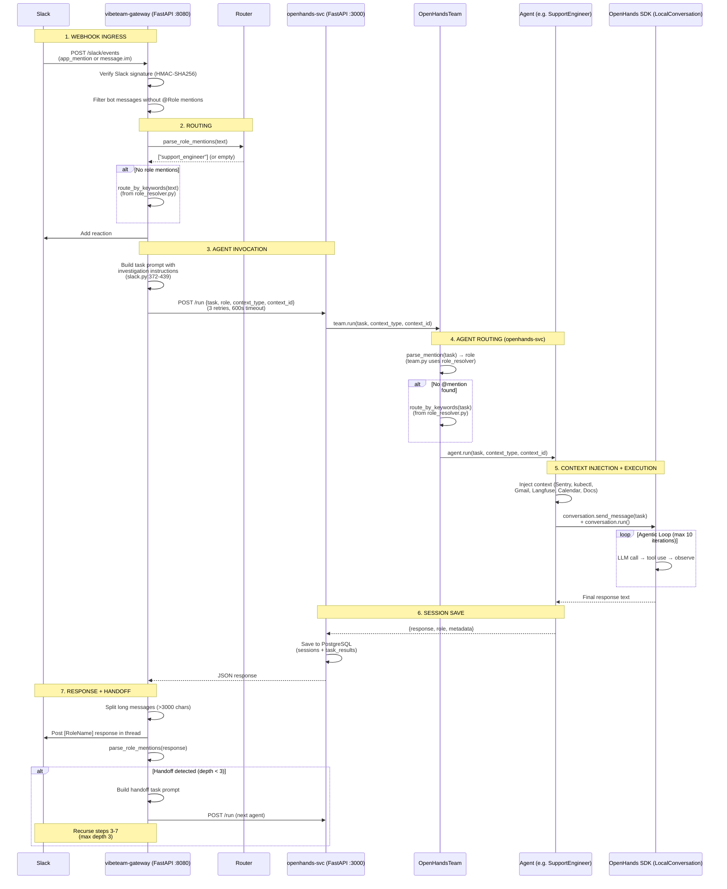

# Current Work Plan

## Active: Eval Rescore & Agent Verification Improvements

**Branch:** `fix/eval-rescore-and-agent-verification`
**Triggered by:** SoftwareEngineer response in Slack thread `1770710833.425539` was never scored (arrived at ~726s, eval timeout was 600s). Manual G-Eval showed EvidenceBasedDecision: 0.50 due to fabricated root cause.

### Changes Implemented

- [x] `--thread-ts` flag for re-scoring existing Slack threads without posting new messages
- [x] `--handoff-timeout` flag + auto-extend timeout when handoff is detected (default: +600s)
- [x] Increased `stable_time_with_handoff` from 60s to 300s (agents take 5-10min)
- [x] SoftwareEngineer: "VERIFY YOUR FIX" instructions (curl after config fix, run tests after code fix)
- [x] SoftwareEngineer: "DO NOT FABRICATE ROOT CAUSES" anti-hallucination guardrails
- [x] All 87 existing tests pass, ruff lint clean
- [x] 27 unit tests for rescore mode + handoff timeout (`tests/test_eval_rescore.py`)
- [x] Live validation: all 4 metrics >= 0.90 on `stripe_webhook_failure` thread
- [x] CI passes (lint, test, unit tests, docker build)

### Files Changed

| File | What Changed |
|------|-------------|
| `scripts/eval_slack_e2e.py` | `--thread-ts` rescore mode, `--handoff-timeout`, auto-extend timeout, stable_time 60→300 |
| `agents/openhands/software_engineer.py` | VERIFY YOUR FIX + DO NOT FABRICATE ROOT CAUSES sections |
| `tests/test_eval_rescore.py` | **NEW** — 27 unit tests for rescore mode + handoff timeout |

### PR Status

**PR #60:** Open, CI passing, ready for review.
- https://github.com/VibeTechnologies/VibeTeam/pull/60

### Usage

```bash
# Re-score an existing thread (no new message posted)
uv run python scripts/eval_slack_e2e.py \
  --scenario stripe_webhook_failure \
  --thread-ts 1770710833.425539 \
  --channel C0AATPSADB8

# Normal eval with extended handoff timeout
uv run python scripts/eval_slack_e2e.py \
  --scenario stripe_webhook_failure \
  --handoff-timeout 900
```

### Live Rescore Results (thread 1770710833.425539)

| Metric | Score | Threshold | Status |
|--------|-------|-----------|--------|
| InvestigationQuality | 1.00 | 0.60 | Pass |
| TaskCompletion | 1.00 | 0.60 | Pass |
| EvidenceBasedDecision | 0.90 | 0.60 | Pass |
| HandoffCompletion | 0.90 | 0.60 | Pass |

### Remaining

- [ ] Merge PR #60, deploy, run full eval to verify SoftwareEngineer improvements

---

## Blocked: GitHub App Auth & Sentry Webhooks (PR #53)

**Status:** Draft PR, merges cleanly, 13 commits behind master.
**PR:** #53 (copilot/integrate-github-app-auth)

### Remaining Work
- [ ] Rebase onto master (no conflicts expected)
- [ ] Add integration tests for webhook routing
- [ ] Merge to master

---

## Blocked: Slack App Webhook URL Configuration

**Status:** Blocked on manual Slack admin access.
**PR:** #54 (merged — manifest fix is on master)

### Manual Steps Required
1. Go to https://api.slack.com/apps/A0AAZGWEAVA/event-subscriptions
2. Change **Request URL** to: `https://webhook.team.vibebrowser.app/slack/events`
3. Go to https://api.slack.com/apps/A0AAZGWEAVA/interactivity
4. Change **Request URL** to: `https://webhook.team.vibebrowser.app/slack/interactive`

---

## Architecture Reference

### End-to-End Flow Diagram



### Agent Architecture

| Agent | Persona | Execution Model | Tools | Context Injection |
|-------|---------|----------------|-------|-------------------|
| **SupportEngineer** | Grace | `send_message()` + `run()` (agentic loop, max 10 iters) | TerminalTool, FileEditorTool | Sentry, kubectl, Gmail, Calendar, Langfuse, Docs (keyword-conditional) |
| **ReleaseEngineer** | Einstein | `send_message()` + `run()` (agentic loop, max 10 iters) | TerminalTool, FileEditorTool | kubectl (always) |
| **SoftwareEngineer** | Alan | `send_message()` + `run()` (agentic loop, max 10 iters) | TerminalTool, FileEditorTool | GitHub issues (if `#NNN`), kubectl (if infra keywords) |
| **ProductManager** | Maya | `ask_agent()` (single LLM call) | None | None |
| **MarketingManager** | Ada | `ask_agent()` (single LLM call) | None (MCP config exists) | Browser context (URL fetch, web search) |

### Role Resolution & Keyword Routing

Consolidated into `agents/shared/role_resolver.py`:
- **Role mention parsing** (PR #59) — Supports full names, short forms (swe/pm), persona names (einstein/grace/ada), and extras (dev/product/marketer/supervisor). 37 unit tests.
- **Keyword routing** (`652cfc6`) — Single `route_by_keywords()` function used by both gateway and openhands-svc. Word-boundary regex prevents false positives. ~50 parametrized tests covering all 5 roles.

### kubectl Context (Parallelized)

`agents/shared/kubectl_tools.py` uses two-phase approach (PR #59):
1. Fetch pods first (~1s) to discover existing deployments
2. Fetch events, logs, rollout history in parallel via `ThreadPoolExecutor`
3. Non-existent deployments auto-skipped

Reduced from worst-case 210s (sequential) to ~11s (parallel).

---

## Completed Work

| PR/Commit | Title | Key Changes |
|-----------|-------|-------------|
| `687f328` | docs: update plan.md | keyword routing done, close PR #51, track PR #53 |
| `652cfc6` | refactor: consolidate keyword routing into role_resolver | Single `route_by_keywords()` in role_resolver.py, word-boundary regex |
| #59 | refactor: consolidate role parsing, parallelize kubectl, merge eval scripts | RoleResolver module, ThreadPoolExecutor kubectl, deleted eval_slack_agent.py |
| #55 | feat: add Documentation Knowledge Base tool for agents | Docs tools for agent knowledge base |
| #54 | fix(slack): correct webhook URLs to use webhook.team subdomain | Manifest fix (blocked on manual Slack config) |
| #57 | fix: secure /slack/trigger endpoint, fix dead code, align role mentions | SLACK_TRIGGER_SECRET, dead code cleanup |
| #56 | fix(eval): improve Azure credential handling | Credential warnings, all 5 eval scenarios pass |
| #52 | fix(ci): ruff lint errors | CI lint fixes |

### Eval Results (all passing)

| Scenario | InvestigationQuality | TaskCompletion |
|----------|---------------------|----------------|
| support_400_errors | 0.90 | - |
| support_notify_check | - (NotificationOnly: 1.00) | - |
| github_issue | - (IssueAnalysis: 0.70) | 0.80 |
| release_deploy | - (DeploymentExecution: 0.90) | 1.00 |
| stripe_webhook_failure | 0.90 | 0.90 |

---
Last updated: 2026-02-10
