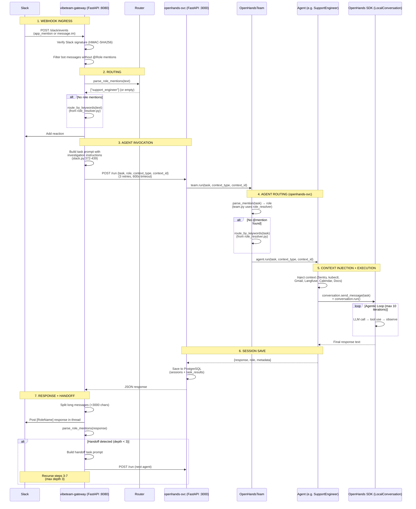

# Current Work Plan

## Active: GitHub App Auth & Sentry Webhooks (PR #53)

**Status:** Draft PR, merges cleanly, 13 commits behind master.
**PR:** #53 (copilot/integrate-github-app-auth)
**Issue:** #49

### What PR #53 Adds
- `GitHubConnector` support for both PAT and GitHub App auth
- Auto-refreshing installation tokens (1hr TTL, 5min buffer)
- `vibeteam/utils/github_app.py` — JWT generation + token exchange
- 13 unit tests (all passing on branch)
- Docs: `docs/github-app-setup.md`, `docs/webhook-routing.md`

### Remaining Work
- [ ] Rebase onto master (no conflicts expected)
- [ ] Fix any new lint issues from rebase
- [ ] Add integration tests for webhook routing (Sentry → agent)
- [ ] Test GitHub issue assignment → agent routing end-to-end
- [ ] Merge to master

---

## Blocked: Slack App Webhook URL Configuration

**Status:** Blocked on manual Slack admin access.
**PR:** #54 (merged — manifest fix is on master)

### Manual Steps Required
1. Go to https://api.slack.com/apps/A0AAZGWEAVA/event-subscriptions
2. Change **Request URL** to: `https://webhook.team.vibebrowser.app/slack/events`
3. Go to https://api.slack.com/apps/A0AAZGWEAVA/interactivity
4. Change **Request URL** to: `https://webhook.team.vibebrowser.app/slack/interactive`
5. Verify: `kubectl logs -f deployment/vibeteam-gateway -n vibeteam | grep -i slack`

### Ingress Routing Reference

| Hostname | Service | Port | Purpose |
|----------|---------|------|---------|
| `team.vibebrowser.app` | openhands-svc | 3000 | OpenHands web UI |
| `webhook.team.vibebrowser.app` | vibeteam-gateway | 8080 | Slack/Discord webhooks |

---

## Open PRs

| PR | Title | Status | Notes |
|----|-------|--------|-------|
| #53 | [WIP] GitHub App auth + Sentry webhooks | Draft | Merges cleanly, needs rebase |

---

## Architecture Reference

### End-to-End Flow Diagram

### Agent Architecture

| Agent | Persona | Execution Model | Tools | Context Injection |
|-------|---------|----------------|-------|-------------------|
| **SupportEngineer** | Grace | `send_message()` + `run()` (agentic loop, max 10 iters) | TerminalTool, FileEditorTool | Sentry, kubectl, Gmail, Calendar, Langfuse, Docs (keyword-conditional) |
| **ReleaseEngineer** | Einstein | `send_message()` + `run()` (agentic loop, max 10 iters) | TerminalTool, FileEditorTool | kubectl (always) |
| **SoftwareEngineer** | Alan | `send_message()` + `run()` (agentic loop, max 10 iters) | TerminalTool, FileEditorTool | GitHub issues (if `#NNN`), kubectl (if infra keywords) |
| **ProductManager** | Maya | `ask_agent()` (single LLM call) | None | None |
| **MarketingManager** | Ada | `ask_agent()` (single LLM call) | None (MCP config exists) | Browser context (URL fetch, web search) |

**Key difference:** `send_message()` + `run()` = full agentic loop with tool access. `ask_agent()` = single LLM call, text-only output.

### Role Resolution & Keyword Routing

Consolidated into `agents/shared/role_resolver.py`:
- **Role mention parsing** (PR #59) — Supports full names, short forms (swe/pm), persona names (einstein/grace/ada), and extras (dev/product/marketer/supervisor). 37 unit tests.
- **Keyword routing** (`652cfc6`) — Single `route_by_keywords()` function used by both gateway and openhands-svc. Word-boundary regex prevents false positives. ~50 parametrized tests covering all 5 roles.

### kubectl Context (Parallelized)

`agents/shared/kubectl_tools.py` uses two-phase approach (PR #59):
1. Fetch pods first (~1s) to discover existing deployments
2. Fetch events, logs, rollout history in parallel via `ThreadPoolExecutor`
3. Non-existent deployments auto-skipped

Reduced from worst-case 210s (sequential) to ~11s (parallel).

---

## Completed Work

| PR/Commit | Title | Key Changes |
|-----------|-------|-------------|
| `652cfc6` | refactor: consolidate keyword routing into role_resolver | Single `route_by_keywords()` in role_resolver.py, word-boundary regex, replaced 100-line method in team.py + 12-line inline in slack.py, ~50 tests |
| #59 | refactor: consolidate role parsing, parallelize kubectl, merge eval scripts | RoleResolver module, ThreadPoolExecutor kubectl, deleted eval_slack_agent.py |
| #55 | feat: add Documentation Knowledge Base tool for agents | Docs tools for agent knowledge base |
| #54 | fix(slack): correct webhook URLs to use webhook.team subdomain | Manifest fix (blocked on manual Slack config) |
| #57 | fix: secure /slack/trigger endpoint, fix dead code, align role mentions | SLACK_TRIGGER_SECRET, dead code cleanup |
| #56 | fix(eval): improve Azure credential handling | Credential warnings, all 5 eval scenarios pass |
| #52 | fix(ci): ruff lint errors | CI lint fixes |

### Closed PRs (superseded)

| PR | Reason |
|----|--------|
| #51 | Superseded — doc upload feature in #55; branch 13 behind master, 42 lint errors |
| #50 | Superseded by #53 (WIP rewrite) |
| #25 | Superseded by #55 (cherry-pick) |
| #58 | Correctly closed — /slack/trigger is correct design |

### Eval Results (all passing)

| Scenario | InvestigationQuality | TaskCompletion |
|----------|---------------------|----------------|
| support_400_errors | 0.90 | - |
| support_notify_check | - (NotificationOnly: 1.00) | - |
| github_issue | - (IssueAnalysis: 0.70) | 0.80 |
| release_deploy | - (DeploymentExecution: 0.90) | 1.00 |
| stripe_webhook_failure | 0.90 | 0.90 |

---
Last updated: 2026-02-10
